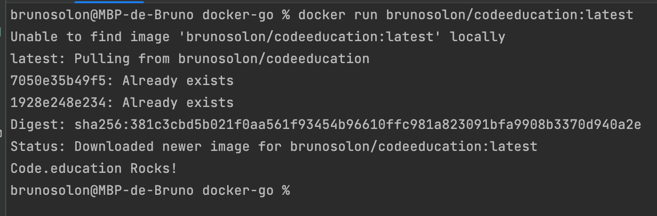

# Desafio Golang com Docker

## Objetivo
Criar um código em Go que exiba "Code.education Rocks!" e gerar uma imagem docker inferior a 2MB

## Docker Hub
```
A imagem também foi publicada no Docker Hub
Para executá-la, execute o seguinte comando:

docker run brunosolon/codeeducation:latest
 ```
O comando acima deve exibir o seguinte resultado:

